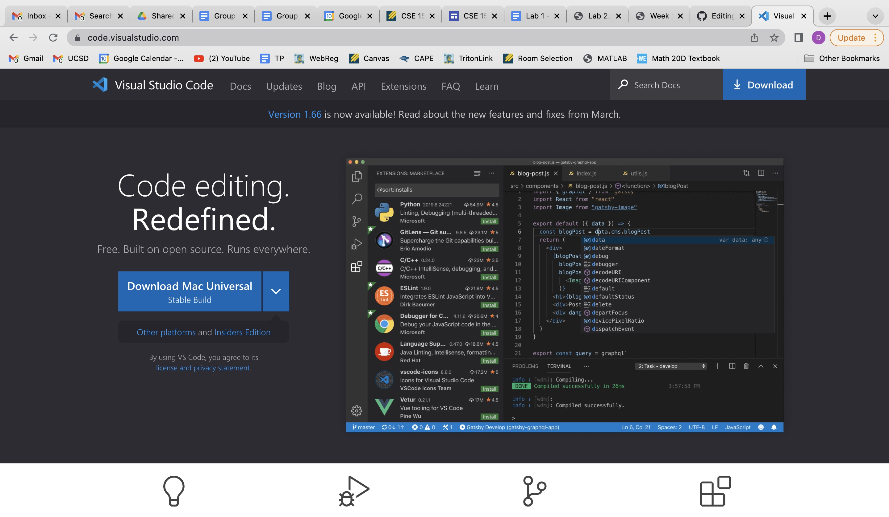

# Lab Report 1
**Team Axolotl**
 

1. **Installing VS Code**

Go to https://code.visualstudio.com/ and follow the instructions. Make sure to download the correct version for your computer. Note the blue download button on the top right.

2. **Remotely Connecting**

3. **Trying Some Commands**

4. **Moving Files with scp**
5. **Setting an SSH Key**
6. **Optimizing Remote Running**

[Lab Report 1](https://dfigueroag.github.io/cse15l-lab-reports/index.html)