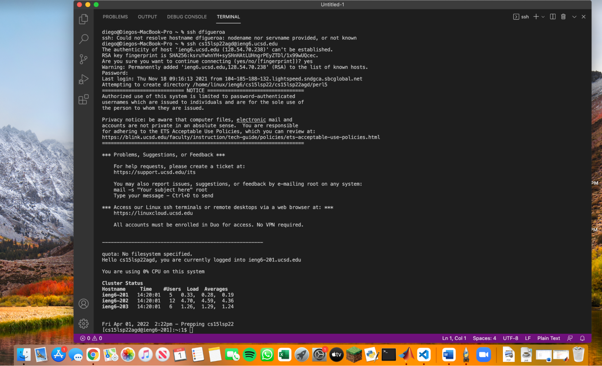
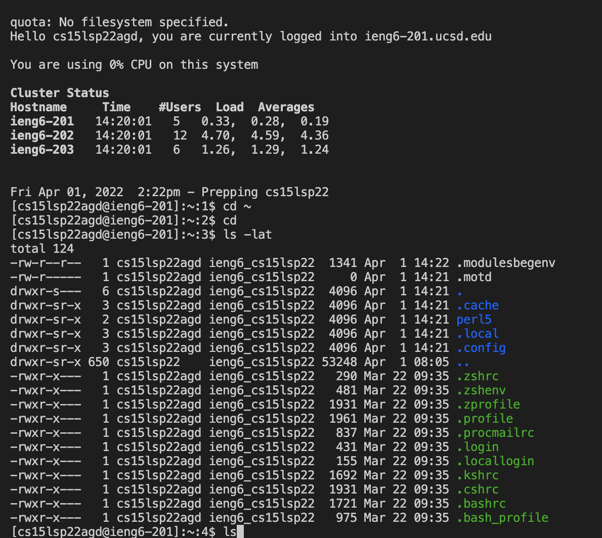

# Lab Report 1
**Team Axolotl**
 

1. **Installing VS Code**

Go to https://code.visualstudio.com/ and follow the instructions. Make sure to download the correct version for your computer. Note the blue download button on the top right.

2. **Remotely Connecting**

On a mac, open Terminal and insert $ ssh cs15lsp22zz@ieng6.ucsd.edu but with the zz replaced by the letters in your specific account. You will get a message asking about continuing to connect, make sure to say yes. Afterwords, give the password you have already established. Once this is done, you will have a screen that looks like the following:

3. **Trying Some Commands**

You can run multiple commands from here. Some interesting ones are cd ~, ls -lat, ls < directory >. Here's a screen shot of my screen after running a few of these:

4. **Moving Files with scp**
5. **Setting an SSH Key**
6. **Optimizing Remote Running**

[Lab Report 1](https://dfigueroag.github.io/cse15l-lab-reports/index.html)