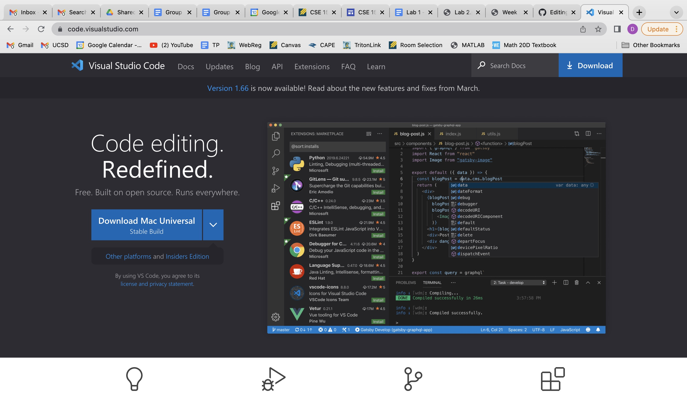
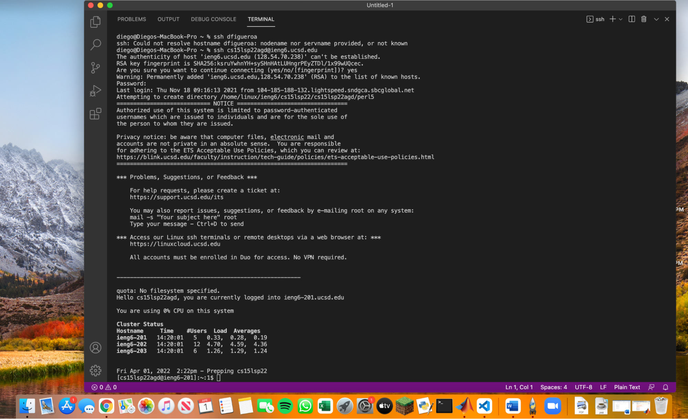
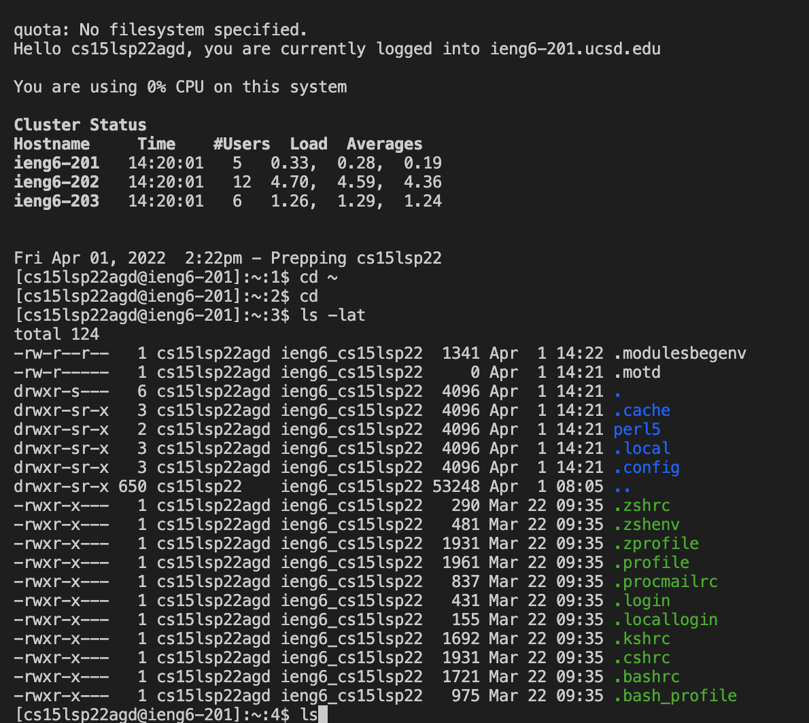
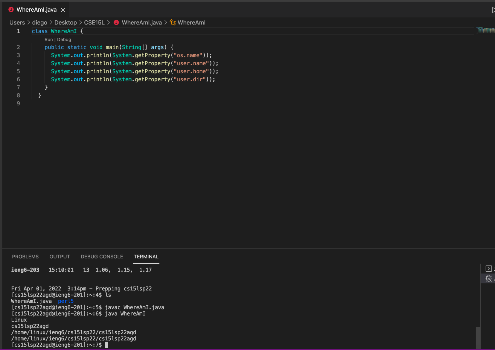
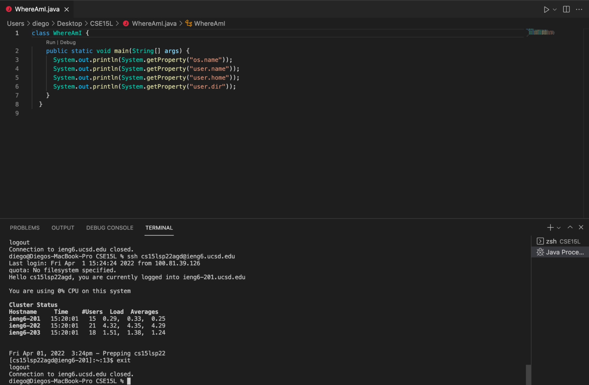
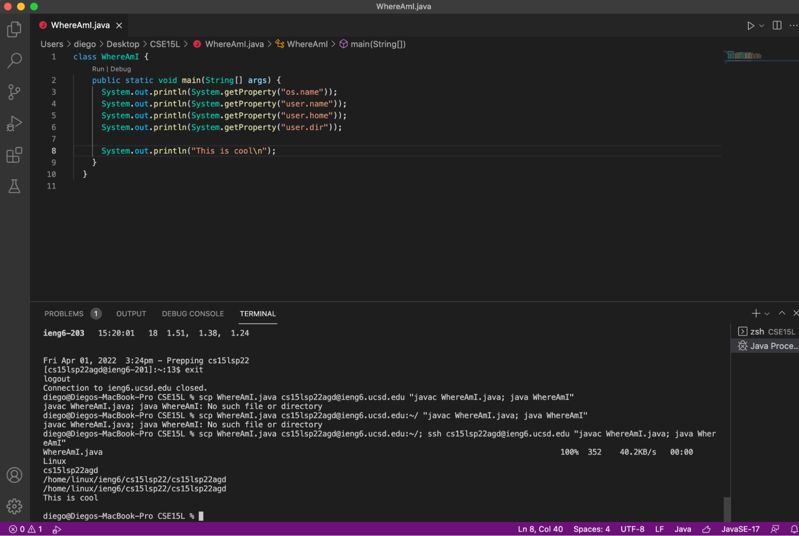
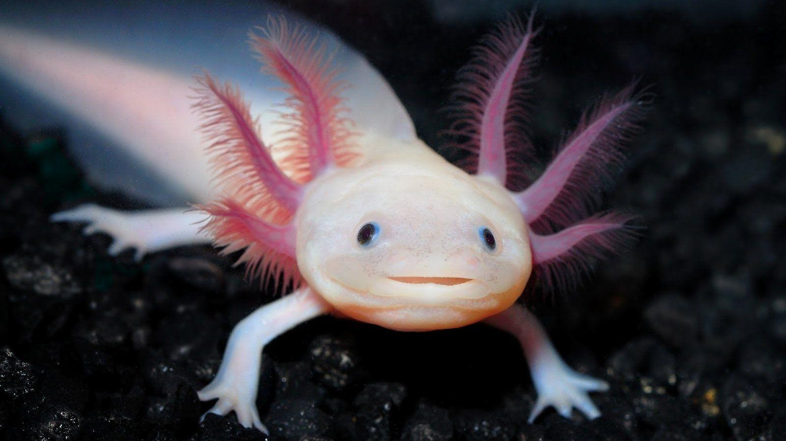

# Lab Report 1
**Team Axolotl**
 

### **Installing VS Code**



Go to https://code.visualstudio.com/ and follow the instructions. Make sure to download the correct version for your computer. Note the blue download button on the top right.

### **Remotely Connecting**

On a mac, open Terminal and insert ```$ ssh cs15lsp22zz@ieng6```.ucsd.edu but with the zz replaced by the letters in your specific account. You will get a message asking about continuing to connect, make sure to say yes. Afterwards, give the password you have already established. Once this is done, you will have a screen that looks like the following:



### **Trying Some Commands**

You can run multiple commands from here. Some interesting ones are ```cd ~```, ```ls -lat```, ```ls <directory>```. Here's a screen shot of my screen after running a few of these:



### **Moving Files with scp**

We can transfer files to and from the server using the ```scp``` command. To do so, first create a file you would like to transfer. Afterwards, run ```scp WhereAmI.java cs15lsp22zz@ieng6.ucsd.edu:~/``` on your own client, with the file you created instead of ```WhereAmI```. Finally, you should be prompted for a password. Now if you log into the ieng6 with the ```ssh``` and use the ```ls``` command, the file should be visible. Once you succeed, it should look like this:



### **Setting an SSH Key**

In order to create a key, run the ```$ ssh-keygen``` command. Make sure not to add a passphrase. Once all the text is printed out, you should get a strange series of characters that represent the key. Now, you need to copy the key into the server. To do this, log in using the ```$ ssh cs15lsp22zz@ieng6.ucsd.edu``` command, make sure to replace the zz with your ID. Then, once logged in, use ```$ mkdir.ssh``` to copy it over.  Finally, if you log out and log in again it should look something like this:




### **Optimizing Remote Running**

As a final tip, you can throw multiple directions in the same command. This is done by using semicolons. An example is the following ```$ cp WhereAmI.java OtherMain.java; javac OtherMain.java; java WhereAmI```. Here is an example of copying a document and running it while logged out:




[Lab Report 1](index.html)