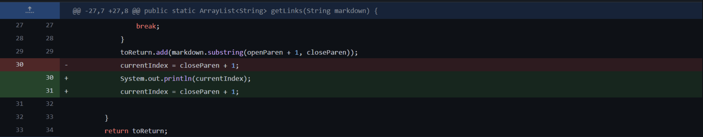
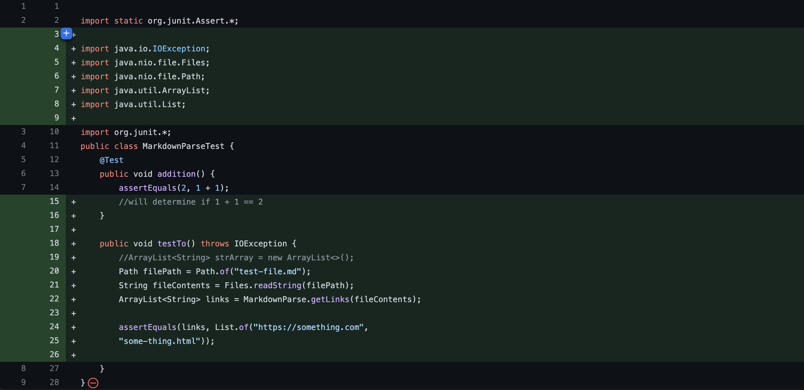

# Lab Report 2
**Team Axolotl**
 

### **Code Change 1**



[Code](https://github.com/kl2024/markdown-parser/blob/main/test-file.md) that induced failure

In this case, the error came from an extra line at the end of the file. This caused the code to crash when compiling as an infinite loop would take place. We debugged this by adding a ```print``` statement of the index that revelead the infinite loop, and so we just deleted the extra line.

### **Code Change 2**


You can run multiple commands from here. Some interesting ones are ```cd ~```, ```ls -lat```, ```ls <directory>```. Here's a screen shot of my screen after running a few of these:

### **Code Change 3**



We can transfer files to and from the server using the ```scp``` command. To do so, first create a file you would like to transfer. Afterwards, run ```scp WhereAmI.java cs15lsp22zz@ieng6.ucsd.edu:~/``` on your own client, with the file you created instead of ```WhereAmI```. Finally, you should be prompted for a password. Now if you log into the ieng6 with the ```ssh``` and use the ```ls``` command, the file should be visible. Once you succeed, it should look like this:


