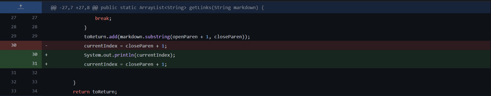
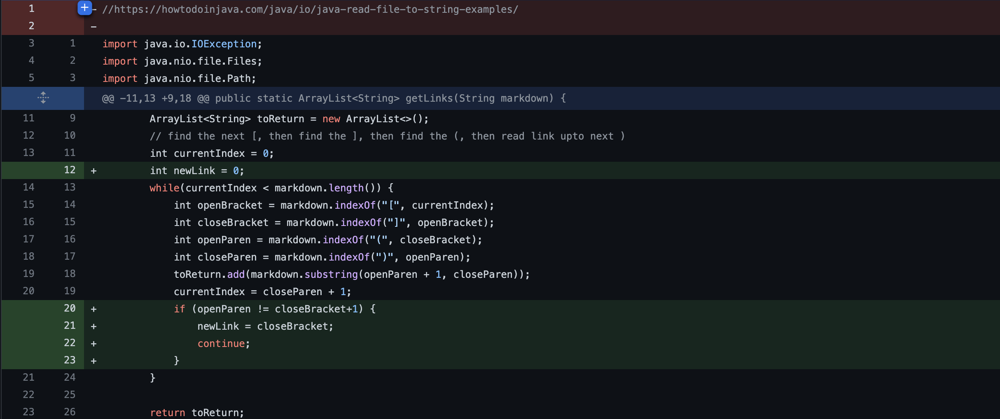
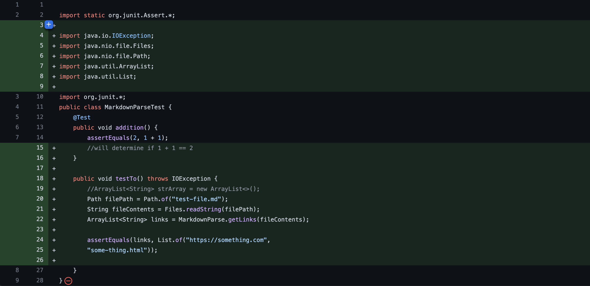

# Lab Report 2
**Team Axolotl**
 

 [Index Page](index.html)

### **Code Change 1**



[Code](https://github.com/kl2024/markdown-parser/blob/main/test-file.md) that induced failure

In this case, the error came from an extra line at the end of the file. This caused the code to crash when compiling as an infinite loop would take place. We debugged this by adding a ```print``` statement of the index that revelead the infinite loop, and so we just deleted the extra line.

### **Code Change 2**



[Code](https://github.com/kl2024/markdown-parser/blob/main/test-file2.md) that induced failure

In the second case, the error came from a space in between the ```[]``` brackets and the ```()``` parenthesis in the file link. Therefore, when the code attempted to read the ```file.md``` link, it did not like it. We were able to debug this by adding an if statement that checks if the closing square bracket is followed by a parenthesis, and not any other space or character. If the closing square bracket is not met by an open parenthesis, it would skip to the index of the open parenthesis.

### **Code Change 3**



[Code](https://github.com/kl2024/markdown-parser/blob/main/test-file3.md) that induced failure


In this case, the bug stemed from not having the required interfaces imported. Consequently when we complied the code we were met with ```illegal start of expression``` and ```cannot find symbol errors```. to debug this, we imported the ```ArrayList``` and ```List``` interfaces.