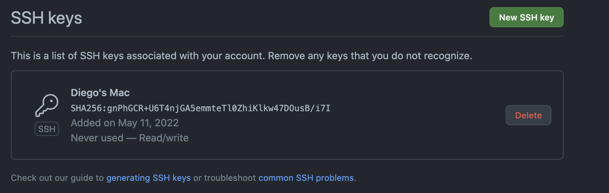
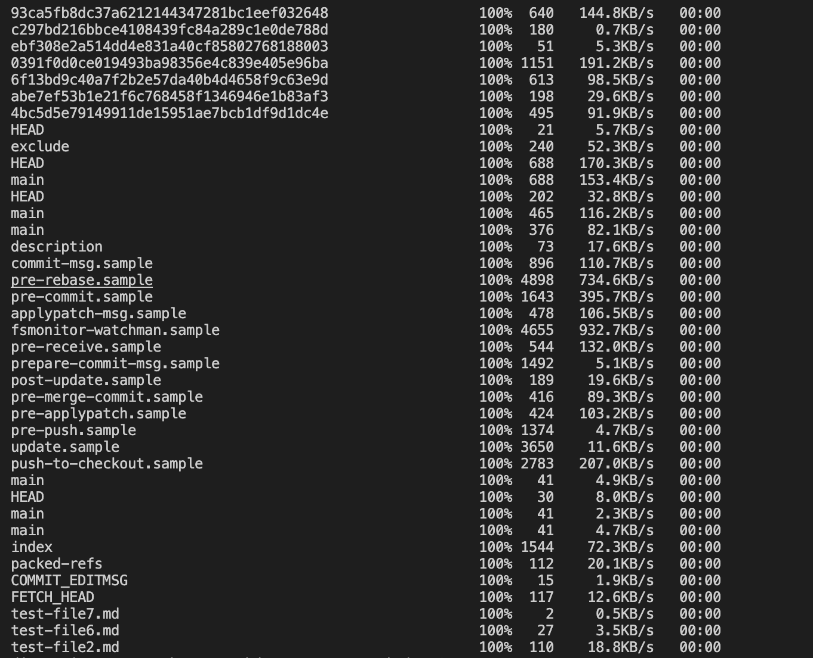
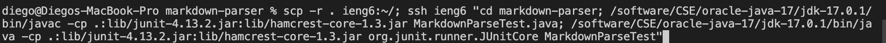

# Lab Report 3
**Team Axolotl**
 

 [Index Page](index.html)

### **Streamlining ssh Configuration**

```.ssh/config``` file:


```ssh``` command of my login:


```scp``` command to copy:


In this case, I simply created an ssh file to make a shortcut. It was the easiest of the three tasks, but finding the ssh folder on a mac proved to be quite the challenge. It works well, and I chose ```ieng6``` to be my alias.

### **Setup Github Access from ```ieng6```**
Picture of where my key is stored on github:

Picture of my key in my user account:

Picture of my key in my user account:

Git commands for push and commit respectively


[Link](https://github.com/dfigueroag/markdown-parser/commit/a5de5996d2d29a48e827b530b5d21356ef47527b) to resulting commit.


This portion deemed to be a lot more challenging as my computer was not liking the git commands. After tutor hours, this issue was promptly fixed. The results were as expected and they work fine.

### **Copy whole directories with ```scp -r```**
Copying whole markdown-parse directory to ```ieng6``` account:



Logging into ```ieng6``` and running tests for repository:


Combining ```scp```, ```;```, and ```ssh``` to copy the whole directory and run the tests in one line:



This portion was also straight forward. No issues where encountered once I fixed my key in part 2. The command line was tedious, but it worked in the end. This allows the process to be streamlined and works well.