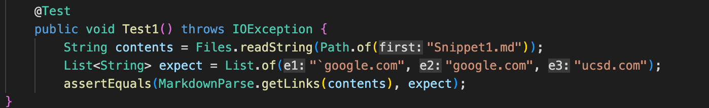
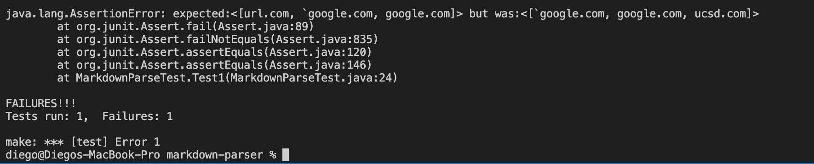
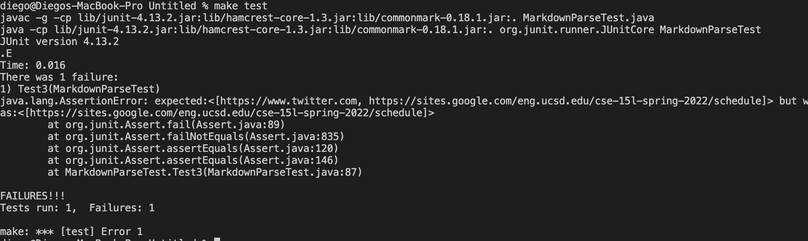

# Lab Report 3
**Team Axolotl**
 

 [Index Page](index.html)

### **Test 1**

Snippet:


The expected output: ``` `google.com```, ```google.com```, ```ucsd.edu```

Test:



My implementation's failure:



The TA implementation's failure:


***What change could be made to make the test pass?***

In this case, I simply created an ssh file to make a shortcut. It was the easiest of the three tasks, but finding the ssh folder on a mac proved to be quite the challenge. It works well, and I chose ```ieng6``` to be my alias.

### **Test 2**

Snippet:


The expected output: ```a.com```, ```a.com(())```, ```example.com```

Test:


My implementation's failure:


The TA implementation's success:


***What change could be made to make the test pass?***

In this case, I simply created an ssh file to make a shortcut. It was the easiest of the three tasks, but finding the ssh folder on a mac proved to be quite the challenge. It works well, and I chose ```ieng6``` to be my alias.

### **Test 3**

Snippet:


The expected output: ```https://sites.google.com/eng.ucsd.edu/cse-15l-spring-2022/schedule```

Test:


My implementation's failure:


The TA implementation's failure:



***What change could be made to make the test pass?***

In this case, I simply created an ssh file to make a shortcut. It was the easiest of the three tasks, but finding the ssh folder on a mac proved to be quite the challenge. It works well, and I chose ```ieng6``` to be my alias.