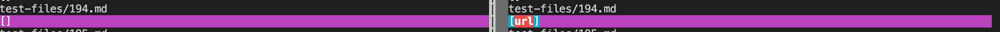
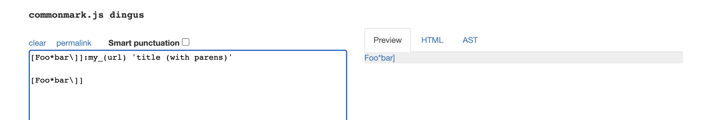
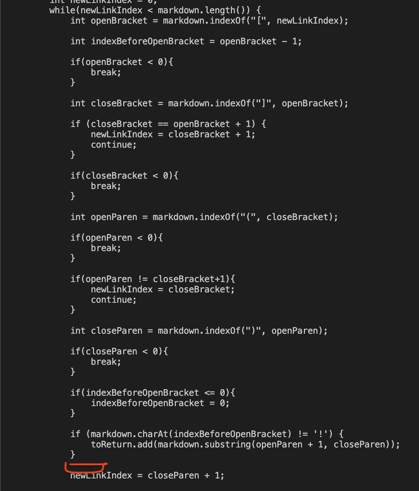
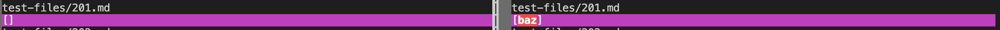
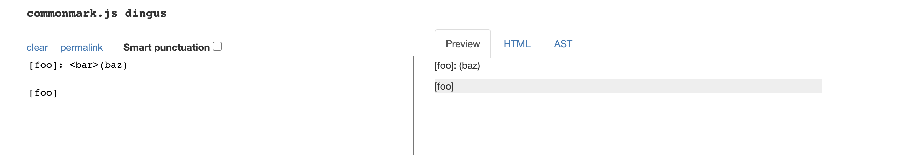

# Lab Report 5
**Team Axolotl**
 

 [Index Page](index.html)

### **Finding Different Results**

Different test results were found by using ```bash script.sh > results.txt``` on both my markdown-parser and the markdown parser from lab 9. With this, a new file with all results was made. From there, the command ```vimdiff markdown-parser/results.txt lab9Markdown-parser/results.txt``` allowed me to compare my implementation and the lab's implementation. The following cases will demonstrate what the output of this looked like.

### **Test Case For File 194**

 [Link to Test 194](https://raw.githubusercontent.com/nidhidhamnani/markdown-parser/main/test-files/194.md)

Output of Comparison:



In this output, it is clear that my test was the correct one. The following image will help show why this is the case:



The desired output should be blank as there is no real link, however the provided implementation does return something that is not a link.

In this case, it is clear that the program is not processing if the link is real or not, so the bug stems from that. It seems as if the code is thrown off by the underscore before the link, and returning whatever is in that spot regardless on what is in it. My proposed solution would be to add some form of check on whether a link has letters or some form of other characters before it. Specifically, perhaps check if there is a piece of text followed by a period and a common link ending soon after, but this is just an idea. I would add the fix on the red square as shown below. It is added at this spot as the rest of the code seems to work fine, and this way it doesn't get in the way of anything and serves as a final check.



### **Test Case For File 201**

 [Link to Test 194](https://raw.githubusercontent.com/nidhidhamnani/markdown-parser/main/test-files/201.md)

Output of Comparison:



In this output, it is also clear that my test was the correct one. The following image will help show why this is the case:



The desired output should be blank as there is no real link, however the provided implementation does return something that is not a link.

In this case, it is clear that the program is not processing if the link is real or not, so the bug stems from that. It seems as if the code takes in the place where there would be a link, and returns whatever is in that spot regardless on whether it is a link or not. My proposed solution would be to add some form of check on whether this is a link or not. Specifically, perhaps check if there is a piece of text followed by a period and a common link ending soon after. I would add the fix on the red square as shown below.

