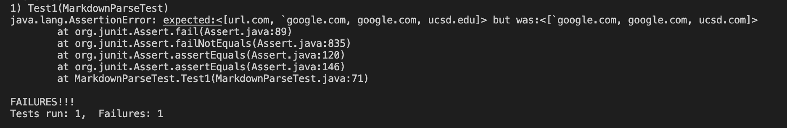

# Lab Report 4
**Team Axolotl**
 

 [Index Page](index.html)

### **Test 1**

Snippet:


The expected output: ``` `google.com```, ```google.com```, ```ucsd.edu```

Test:


My implementation's failure:


The TA implementation's failure:



***What change could be made to make the test pass?***

While I am uncertain how I would fix it exactly, it is clear the issue is the backtick before the first line in the snippet. If that backtick were missing, it would be able to run properly. Therefore, it becomes a matter of making the code ignore the backtick. Perhaps making a counter that takes into account the amount of open brackets, and if there is a backtick before any open brack it it ignores the backtick.

### **Test 2**

Snippet:


The expected output: ```a.com```, ```a.com(())```, ```example.com```

Test:


My implementation's failure:


The TA implementation's success:


***What change could be made to make the test pass?***

In this case, do not think that the code issue could be resolved in under 10 lines. In this case, I am also unsure what it is exactly in the behaviour of the function that makes it act the way it does. However, if the issue is in the nested brackets as I believe, then certain conditions in addition to a counter must be added. This way all nested paranthesis can be skipped, but this would require over 10 lines.

### **Test 3**

Snippet:


The expected output: ```https://sites.google.com/eng.ucsd.edu/cse-15l-spring-2022/schedule```

Test:


My implementation's failure:


The TA implementation's failure:


***What change could be made to make the test pass?***

In this case, I do believe that the issue could be solved in under 10 lines. Contrary to snippet 2, no odd conditions are required to solve this, just a parenthesis counter. This way one could open the parenthesis and ignore any new lines within it. By doing so it would make the whole link more legible and hopefully work.